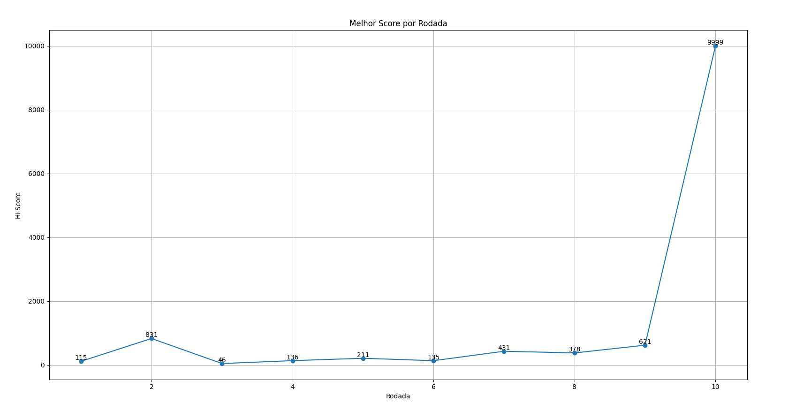

# DinoGame

Réplica do "jogo do dinossauro" do google. A ideia do projeto consiste em clonar o repositório do jogo e, baseado nele, desenvolver uma inteligência artificial baseada em computação evolutiva para jogar automaticamente e alcançar o maior score possível.

# Algorimos escolhidos

Foram desenvolvidos algoritmos de Mutation e de Crossover + Mutation. Também houve a tentativa de implementar o crossover "puro", isto é, sem mutation. Contudo, devido à semelhança entre os dinossauros, principalmente no começo, onde diversos dinossauros realizam o mesmo comportamento, não foi possível obter uma variabilidade genética suficiente apenas com este método.

# Class NeuralNetwork

Para ambos os métodos, foi utilizada uma mesma classe NeuralNetwork, que consiste na rede neural que irá ser aplicada nos dinossauros. A classe consiste na criação de uma matriz com 10 valores de entrada e 3 saídas (up, down e forward), e a definição de valores aleatórios [-0.5; 0.5]. A classe também possui a função predict, que consiste na atribuição dos pesos na rede neural e na identificação de qual a melhor saída baseado nisso.

# Function GamePredict

loop que irá percorrer a lista que contém todos os dinossauros existentes no jogo e, para cada um deles, irá realizar a predição de qual a melhor saída (ação).


# Mutation

Para a aplicação do método Mutation, foram criadas duas funções, sendo elas "Mutate" e "GameWithMutate". 

A primeira delas consiste na aplicação da mutação de fato, na qual será gerada uma matriz aleatória multiplicada pelo mutation_rate e mistura com os pesos atuais, isto é, irá misturar a matriz de pesos do dinossauro escolhido com pequenos valores aleatórios definidos pelo "mutation_rate", que define o nível de mutação que será realizada.

Já o GameWithMutate consiste no loop principal de execução do jogo que utiliza o Mutation puro. Primeiro, será gerada uma lista de ações contendo a predição para cada dinossauro, utilizando o GamePredict(), depois irá executar cada ação e, por fim, quando der gameover, irá identificar o melhor dinossauro e gerar uma nova população tendo este como base, mas aplicando a função "mutate" para realizar a mutação em cada um.


# Crossover + Mutation

Seguindo uma lógica semelhante, para o Crossover + Mutation, foram criadas duas novas funções, sendo elas a "Crossover" e a "GameWithCrossover", além da utilização da função "Mutate" citada anteriormente.

A função Crossover receberá como parametros os dois dinossauros "pai", definir um ponto de crossover aleatório e definir que os pesos que vierem antes do ponto definido serão referentes ao pai 1 e o que vier após o ponto será referente ao pai 2.

Já a função GameWithCrossover segue uma lógica semelhante à GameWithMutate, tendo como unica diferença que, para criar a nova população, será feito um crossover entre o melhor dinossauro e algum dinossauro aleatório, aplicando a função Crossover explicada anteriormente. Após a realização do Crossover, será realizada uma mutação no novo indivíduo gerado, utilizando a função Mutate anterior.

# Análise de resultados


Foram realizados testes de ambos os algoritmos. Para cada um deles, foi feita a comparação, também, entre diferentes valores de "mutation_rate", que equivale ao quanto cada dinossauro gerado irá se diferir do seu predecessor. Para ambos Mutation e Crossover, foram testados os valores de 0.1, 0.3 e 0.5. Em todos os testes, foram atribuidos os valores de 500 FPS, que controlava basicamente a velocidade dos testes, e 100 dinossauros. Todas as tentativas foram realizadas em um espaço de 30 iterações (Game Over) para cada situação, onde caso o dinossauro fosse convergir a pontuação infinita (que ocorre a partir de determinada velocidade e distancia) o teste era limitado no score de 3000 e era efetuado o teste seguinte.

É importante considerar que para alcançar esse resultado foi necessário efetuar alterações no código fonte do jogo para que se tornasse compatível com o nosso código. Desse modo, a utilização do repósitorio disponibilizado como fonte foi substituído por outro arquivo fonte "newDinoGame.py" que toma o mesmo como base, porém possuem alterações para correções de erros, fazendo com que a execução do código seja efetuada pelo terminal e não pelo poetry shell.

Sendo assim, foi possível observar que em todas as situações o algoritmo tendia a convergir, alterando em si somente a velocidade em que isso ocorre.
## Resultados do Mutate:
### Mutate com Mutation Rate de 0.1


### Mutate com Mutation Rate de 0.3


### Mutate com Mutation Rate de 0.5



##Resultados do Crossover:
### Crossover com Mutation Rate de 0.1


### Crossover com Mutation Rate de 0.3


### Crossover com Mutation Rate de 0.5


A partir da análise dos resultados demonstrados acima, é possível identificar que, para o método do crossover houve uma tendência de ocorrer uma convergência mais rápida com o mutation_rate de 0.1. É importante destacar também que, apesar do esperado ser que o método mais completo tenha um resultado melhor, todos os casos de testes atingiram a pontuação infinita em determinado momento.

## Vídeo do início do treinamento do dinossauro:
[Vídeo do ínicio do treinamento](https://www.youtube.com/watch?v=yxx8C_2z56Q)

## Vídeo do treinamento em estágio avançado:
[Vídeo do treinamento após algumas rodadas](https://youtu.be/L0-lAbAaDFo)

Portanto, para a análise do caso do melhor indivíduo foi selecionado o peso de um dino que atingiu essa pontuação com esse parâmetro de mutation_rate em 0.1 no método de Crossover.

## Análise do melhor indivíduo

### Peso do melhor indivíduo
```python
best_weights = np.array([
                    [ 0.05873744, -0.18737166,  0.15162923],
                    [ 0.37904898, -0.29948954, -0.208433  ],
                    [-0.22294232, -0.39653523, -0.30959169],
                    [-0.18026223,  0.31192445, -0.52114996],
                    [ 0.12461262,  0.44634745,  0.29608551],
                    [ 0.36585901,  0.52571237,  0.18866291],
                    [-0.20084327,  0.34464733,  0.1182346 ],
                    [ 0.1549635,   0.17118189,  0.14192513],
                    [-0.40021329, -0.01655103, -0.33633056],
                    [-0.1028232 , -0.31744194, -0.06333987]])
```

Os dinossauros foram colocados para efetuar 30 iterações de rodadas até o game over, onde conforme eles tivesse, a tendência de atingir a pontuação infinita, o jogo era encerrado no score de 3000 para que pudessem ser plotados os resultados. Entretanto, será exibido um vídeo onde é possível observar o melhor indivíduo sem restrições e exibindo seu comportamento de jogar infinitamente.

### Comportamento dos dinossauros durante as iterações


## Best Dino
Por fim, aplicamos a função PlayWithBestDino() para jogar com o nosso melhor dinossauro e observar o comportamento dele.
### Vídeo do melhor dino rodando infinitamente
[Vídeo do melhor indivíduo](https://youtu.be/I4whPXl93Gw)